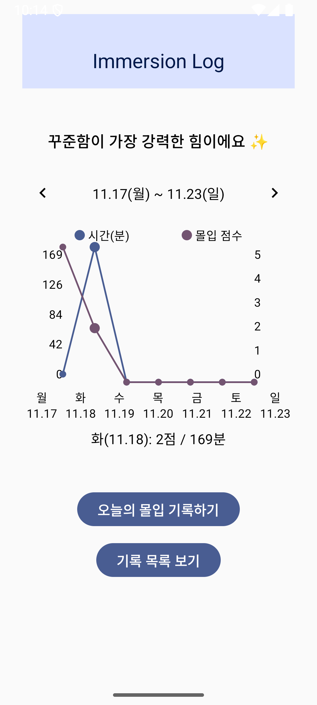
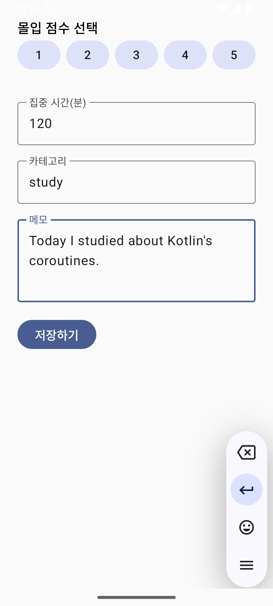
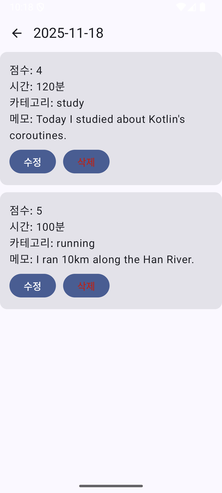
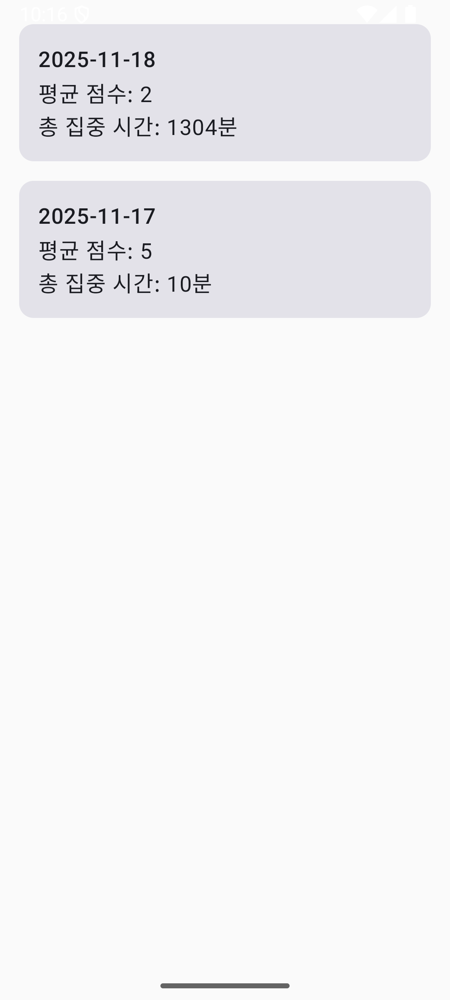

# Immersion_Log
woowacourse - Open Mission


# 📘 몰입로그 (Immersion Log)

## 1. 왜 이 프로젝트를 진행했는가

프리코스를 진행하며 하루의 학습 패턴, 집중도, 몰입 흐름을 관찰하는 일이 매우 중요하다는 것을 느꼈습니다. 하지만 기록을 체계적으로
정리할 도구가 부족했고, 일관된 방식으로 데이터화하기가 쉽지 않았습니다. 이를 해결하기 위해, **하루의 몰입을 입력하고 저장하며, 
스스로의 성장 흐름을 확인할 수 있는 모바일 앱**을 직접 만들어 보기로 했습니다. 또한 이번 프로젝트는 **Kotlin + Android + 앱
아키텍처(MVVM)** 를 학습하기 위한 실전 경험을 목표로 합니다.

---

## 2. 프로젝트 소개

- **몰입로그(Immersion Log)** 는 하루의 몰입 점수,집중 시간,메모를 기록하여 ‘어제보다 나은 나’를 확인할 수 있게 돕는 개인
성장 기록 앱입니다. 간단한 화면 구성과 깔끔한 아키텍처를 기반으로 한 Kotlin Android 앱으로, 주간 통계 그래프와 일일 기록 기능
을 통해 몰입 패턴을 시각적으로 확인할 수 있습니다.

---

## 3. 주요 기능

###  1) 오늘의 몰입 기록 입력 및 수정

- 몰입 점수(1~5) 버튼 선택
- 집중 시간(분) 입력
- 카테고리 입력
- 메모 입력
- 새 기록 저장 또는 기존 기록 수정

###  2) 홈 화면 – 성장 메시지 & 주간 통계

- 오늘 기록이 있을 경우 어제와 비교해 점수, 집중 시간이 증가했는지 안내하는 성장 메시지 표시
- 최근 일주일간의 평균 점수와 평균 집중 시간을 선 그래프로 표시, 터치 시 해당 요일의 수치를 확인할 수 있고, 
좌우 화살표로 지난주/다음 주로 이동 가능

###  3) 일별 기록 목록 조회

- 날짜별로 그룹화된 기록 목록을 최신 순으로 보여주며, 각 날짜 카드에는 평균 점수와 총 집중 시간을 표시
- 날짜 카드를 터치하면 해당 날짜의 상세 기록 화면으로 이동

###  4) 일일 기록 상세 보기

- 특정 날짜에 입력된 여러 개의 기록을 모두 확인할 수 있으며, 각 기록 카드에서 점수, 시간, 카테고리, 메모를 볼 수 있음
- 기록 별로 수정 및 삭제 기능 제공

###  5) 단일 기록 상세 보기

- 단일 기록의 상세 정보를 확인하고 수정하거나 삭제할 수 있는 화면 제공

---

## 4. 구성 UI

| 화면           | 설명                                                           |
|--------------|--------------------------------------------------------------|
| **홈 화면**     | 성장 메시지, 주간 통계 그래프 및 이전/다음 주 이동 버튼, 오늘 기록 입력 버튼, 기록 목록 보기 버튼  |
| **기록 입력 화면** | 점수 버튼(1~5), 시간 입력, 카테고리 입력, 메모 입력, 저장/수정 버튼                  |
| **기록 목록 화면** | 날짜별 기록 리스트(평균 점수·총 집중시간 표시), 터치 시 일일 기록으로 이동                 |
| **일일 기록 화면** | 특정 날짜에 입력된 모든 기록 리스트, 각 항목에 수정/삭제 버튼                         | 
| **상세 화면**    | 단일 기록 상세 정보 확인 및 수정/삭제                                       |

---
<table align="center">
  <tr>
    <td align="center">
      <br/>
      <sub>[ 홈 화면 ]</sub>
    </td>
    <td align="center">
      <br/>
      <sub>[ 로그 작성 ]</sub>
    </td>
    <td align="center">
      <br/>
      <sub>[ 일일 상세 ]</sub>
    </td>
    <td align="center">
      <br/>
      <sub>[ 기록 목록 ]</sub>
    </td>
  </tr>
</table>


---

## 5. 기술 스택

### **Language & Framework**

- Kotlin
- Android SDK
- Jetpack Compose

### **Architecture**

- MVVM (ViewModel + StateFlow)
- Repository Pattern
- UseCase Pattern
- Clean Architecture 레이어 분리

### **Data**

- Room Database
- Hilt (DI)

---

## 6. 앱 패키지 구조

```
com.immersionlog.app
 ├─ data
 │   ├─ local
 │   │   ├─ dao
 │   │   └─ database
 │   └─ repository
 │
 ├─ di
 │
 ├─ domain
 │   ├─ entity
 │   ├─ repository
 │   └─ usecase
 │
 ├─ ui
 │   ├─ home
 │   ├─ record
 │   ├─ list
 │   └─ detail
 │
 └─ utils
     
```
